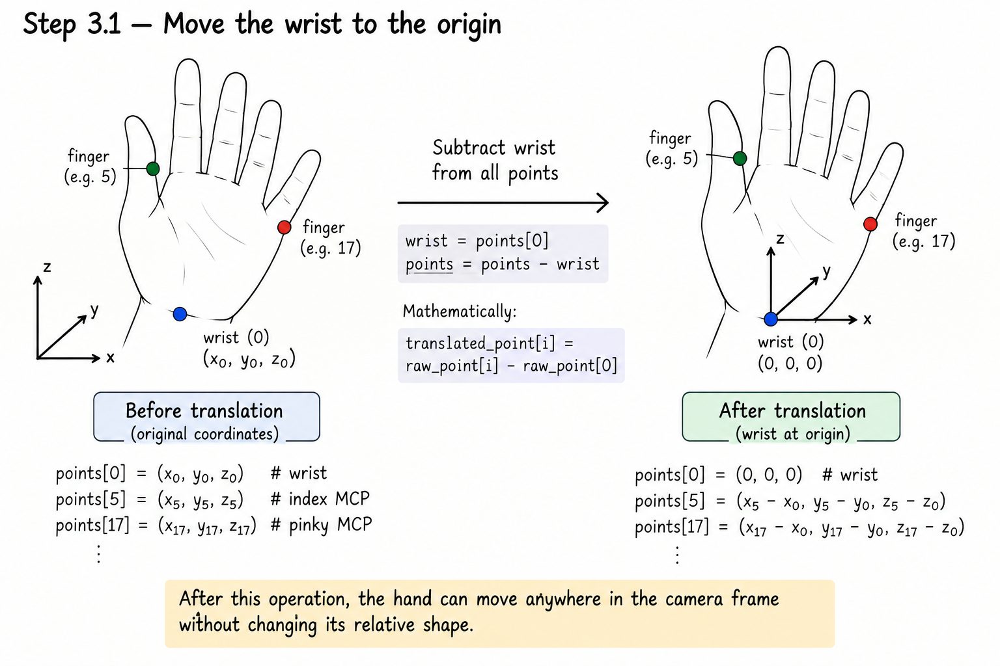
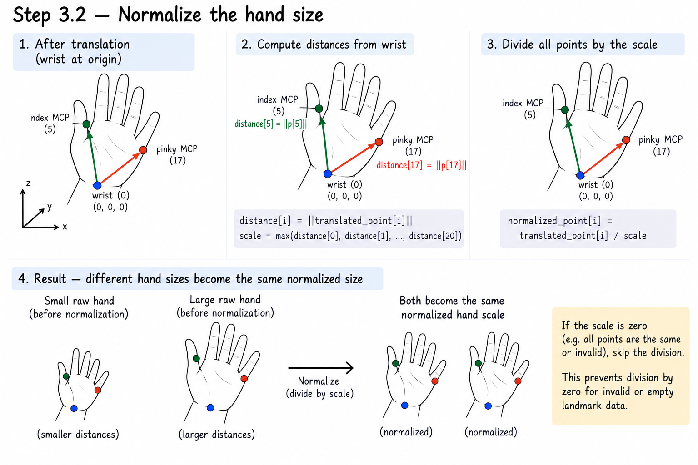
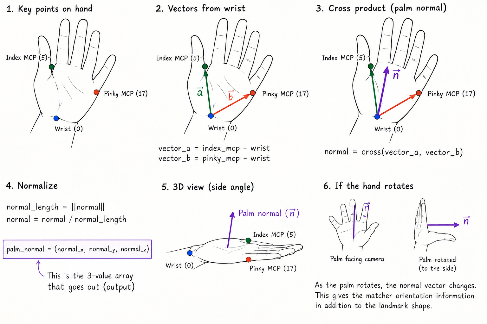
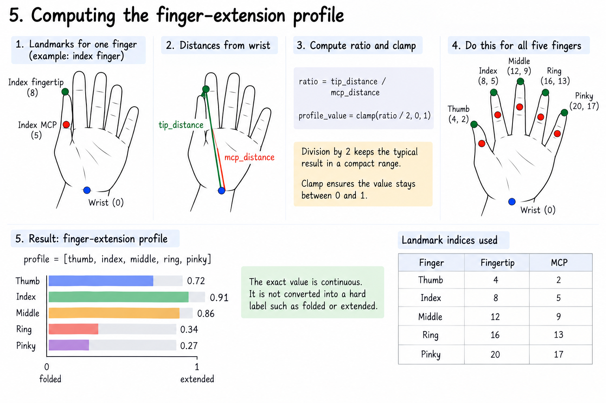
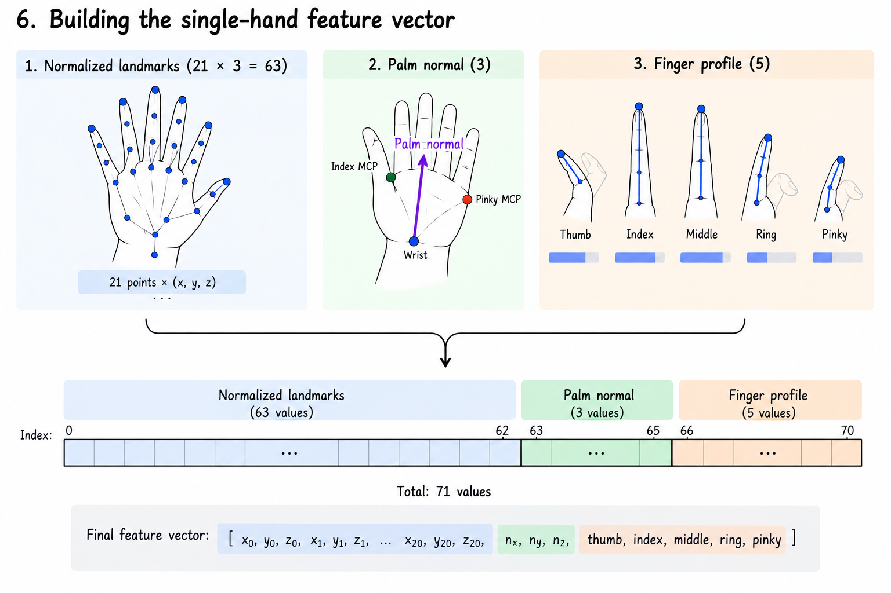
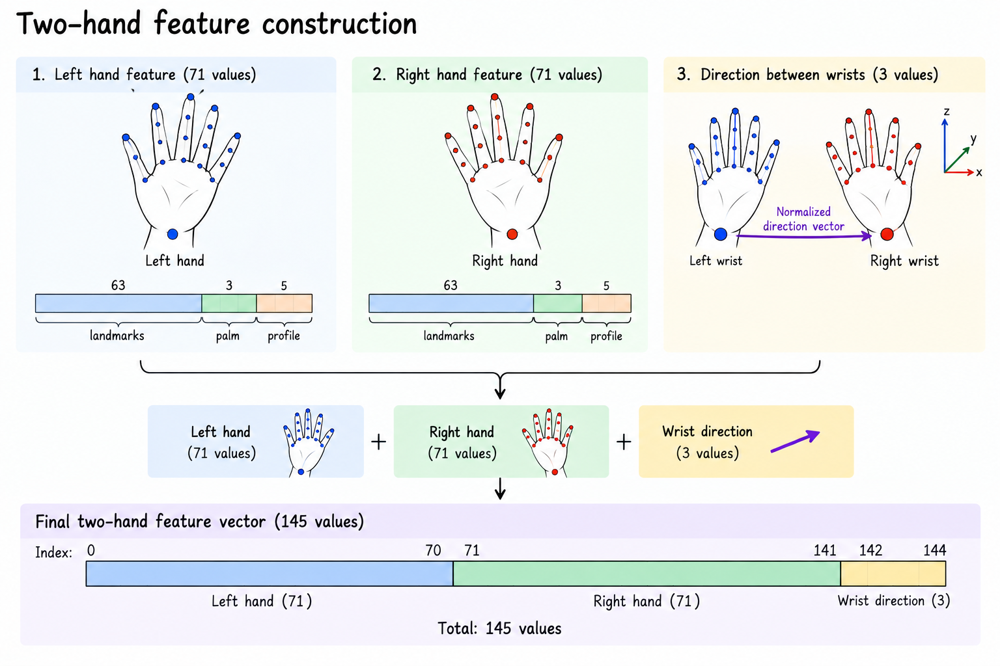
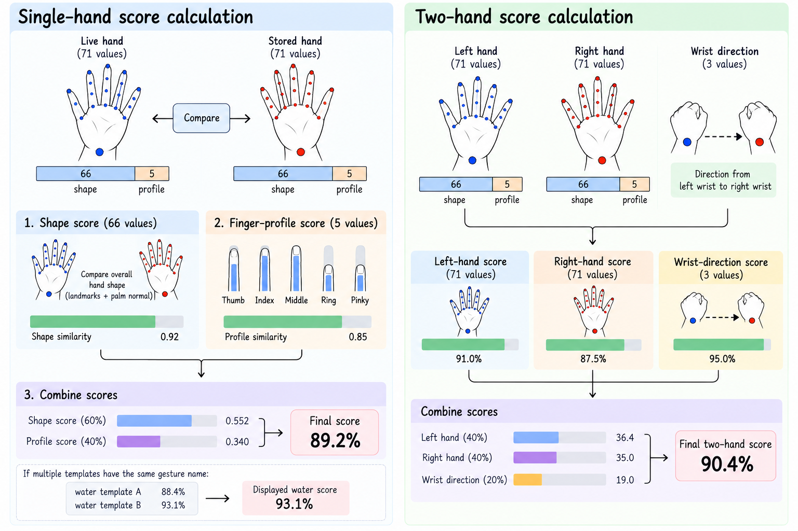

# How Hand Gesture Matching Works

This document describes the actual data flow in the hand gesture matching
experiment. It explains what the camera gives us, how the data is transformed,
what is stored in `gestures.json`, and what calculations happen during live
matching.

The complete process is:

```text
Camera frame
    │
    ▼
MediaPipe Hands
    │
    ├── 21 landmarks per hand: (x, y, z)
    └── handedness: Left / Right
    │
    ▼
Normalize each hand
    │
    ▼
Build numerical feature vector
    │
    ▼
Register and average  ───────────────┐
    │                                │
    ▼                                ▼
gestures.json                 Compare live vector
                                     │
                                     ▼
                              Similarity score
```

The system compares geometric descriptions of hands. It does not compare raw
camera images or pixels.

---

## 1. Data received from the camera

The webcam provides an image frame. The vision engine sends that frame to
MediaPipe Hands.

MediaPipe returns up to two detected hands. Each hand contains 21 landmarks.
Every landmark has three floating-point coordinates:

```text
landmark[i] = (x, y, z)
```

The input for one detected hand looks conceptually like this:

```text
hand_landmarks = [
    [x0,  y0,  z0 ],   # wrist
    [x1,  y1,  z1 ],   # thumb joint
    [x2,  y2,  z2 ],
    ...
    [x20, y20, z20]    # pinky fingertip
]
```

There are:

```text
21 landmarks × 3 coordinates = 63 raw values per hand
```

The coordinate meaning is:

| Coordinate | Meaning |
|---|---|
| `x` | Horizontal position in the camera image. |
| `y` | Vertical position in the camera image. |
| `z` | Relative depth estimated by MediaPipe. |

MediaPipe also returns handedness. For two hands, the application uses this to
separate the landmarks into `left_pts` and `right_pts`.

```text
Detected hands
      │
      ├── MediaPipe says Left  ──▶ left_pts
      └── MediaPipe says Right ──▶ right_pts
```

The matching system does not use the hand bounding box as a feature. It uses
the 21 landmark coordinates.

---

## 2. Landmark numbering

The landmarks describe the wrist, palm, and finger joints:

```text
                         8       12      16      20
                         ●       ●       ●       ●
                         │       │       │       │
                         7       11      15      19
                         ●       ●       ●       ●
                         │       │       │       │
                         6       10      14      18
                         ●       ●       ●       ●
                         │       │       │       │
                         5        9       13      17
                         ●       ●       ●       ●
                          \      │       │      /
                           \     │       │     /
                       4    ●────┴───────┴────●  Thumb / palm
                        \
                         ●3
                         |
                         ●2
                         │   
                         ●1   0  Wrist
```

The important indices used by the feature calculations are:

| Purpose | Landmark indices |
|---|---|
| Wrist | `0` |
| Thumb tip / MCP | `4` / `2` |
| Index tip / MCP | `8` / `5` |
| Middle tip / MCP | `12` / `9` |
| Ring tip / MCP | `16` / `13` |
| Pinky tip / MCP | `20` / `17` |

---

## 3. Normalizing one hand

The raw coordinates depend on where the hand is and how close it is to the
camera. The same gesture might produce very different raw coordinates:

```text
Frame A                         Frame B
┌───────────────┐               ┌───────────────┐
│  small hand   │               │               │
│       ✋      │               │          ✋  │
└───────────────┘               └───────────────┘
 left + far                     right + close
```

The system removes those differences in two steps.

### Step 3.1 — Move the wrist to the origin

The wrist is landmark `0`. First, copy the wrist and subtract it from every
landmark:

```python
wrist = points[0]
points = points - wrist
```

Mathematically:

```text
translated_point[i] = raw_point[i] - raw_point[0]
```



*The wrist is subtracted from every landmark, so landmark `0` becomes the
origin and the remaining points describe relative hand geometry.*

After this operation:

```text
translated_point[0] = (0, 0, 0)
```

The hand can now move anywhere in the camera frame without changing its
relative shape.

```text
Before translation              After translation

       ● finger                         ● finger
       │                                │
       ●                                ●
       │                                │
       ● wrist                          ● wrist = (0, 0, 0)
```

### Step 3.2 — Normalize the hand size

Next, calculate the distance from the wrist to every landmark:

```text
distance[i] = ||translated_point[i]||
```

The largest distance becomes the scale:

```text
scale = max(distance[0], distance[1], ..., distance[20])
```

Every translated point is divided by that scale:

```text
normalized_point[i] = translated_point[i] / scale
```

The hand now has a consistent approximate size:

```text
Small raw hand  ──┐
                  ├──▶ same normalized hand scale
Large raw hand  ──┘
```



*The largest wrist-to-landmark distance is used as the scale before dividing
all translated points.*

If the scale is zero, division is skipped. This prevents division by zero for
invalid or empty landmark data.

### Result of normalization

The output is still 21 three-dimensional points, but now they describe the
hand relative to its wrist and relative to its own size:

```text
21 raw points  ──translate──▶ 21 centered points
                                      │
                                      └──divide by max distance──▶
                                          21 normalized points
```

Normalization removes translation and scale. It does not remove the hand's
shape or its 3D orientation.

---

## 4. Computing the palm normal

The palm normal describes the orientation of the palm in 3D space.

Three landmarks are used:

```text
Wrist       = normalized_point[0]
Index MCP   = normalized_point[5]
Pinky MCP   = normalized_point[17]
```

Two vectors are created from the wrist:

```text
vector_a = index_mcp - wrist
vector_b = pinky_mcp - wrist
```

Their cross product produces a vector perpendicular to the palm plane:

```text
normal = cross(vector_a, vector_b)
```

The vector is then converted into a unit vector:

```text
normal_length = ||normal||
normal = normal / normal_length
```

The result is three values:

```text
palm_normal = (normal_x, normal_y, normal_z)
```

Visual model:

```text
             Index MCP (5)
                    ●
                   / \
                  /   \
                 /     \
          Wrist ●───────● Pinky MCP (17)
                    │
                    │ perpendicular arrow
                    ▼
              Palm normal
```



*The palm normal is the normalized cross product of the two vectors from the
wrist to the index and pinky MCP landmarks.*

If the palm rotates, the normal vector changes. This gives the matcher
orientation information in addition to the landmark shape.

---

## 5. Computing the finger-extension profile

The normalized landmarks are also used to calculate five values describing
finger extension:

```text
profile = [thumb, index, middle, ring, pinky]
```

For each finger, the system measures two distances from the wrist:

```text
tip_distance = distance(fingertip, wrist)
mcp_distance = distance(finger_mcp, wrist)
```

Then it calculates:

```text
ratio = tip_distance / mcp_distance
profile_value = clamp(ratio / 2, 0, 1)
```

The division by `2` keeps the typical result in a compact range. The clamp
ensures that every value stays between `0` and `1`.

```text
Finger profile

Thumb   ─────────────── 0.72
Index   ───────────────────── 0.91
Middle  ──────────────────── 0.86
Ring    ─────── 0.34
Pinky   ───── 0.27
                         0             1
                      folded       extended
```

The exact value is continuous. It is not converted into a hard label such as
`folded` or `extended`.

The five calculations use:

| Finger | Fingertip | MCP |
|---|---:|---:|
| Thumb | `4` | `2` |
| Index | `8` | `5` |
| Middle | `12` | `9` |
| Ring | `16` | `13` |
| Pinky | `20` | `17` |



*The same distance-ratio calculation is repeated for all five fingers.*

---

## 6. Building the single-hand feature vector

The normalized landmark matrix is flattened from `21 × 3` into 63 numbers:

```text
normalized landmarks = 63 values
palm normal          =  3 values
finger profile       =  5 values
                              ─────
                              71 values
```

The final version 2 vector is assembled in this exact order:

```python
features = (
    normalized_points.flatten()
    + palm_normal
    + finger_profile
)
```

Visual layout:

```text
Index:      0 ........................................ 62 | 63 .. 65 | 66 .. 70
            └──── normalized landmarks ─────────────────┘ └ palm ──┘ └ profile ┘

Values:     [ x0,y0,z0, x1,y1,z1, ... x20,y20,z20,
              nx,ny,nz,
              thumb,index,middle,ring,pinky ]
```



*The normalized landmarks, palm normal, and finger profile are concatenated
into one 71-value vector.*

This 71-value list is the main description of one hand.

---

## 7. Registering and storing a gesture

Registration happens before live recognition. The user chooses a name and
chooses whether the gesture uses one or two hands.

### Single-hand registration flow

```text
User holds gesture
       │
       ▼
Press 'r'
       │
       ▼
Read 21 raw landmarks
       │
       ▼
Normalize + extract 71 features
       │
       ▼
Store sample temporarily in memory
       │
       ├── repeat for several samples
       ▼
Average every feature position
       │
       ▼
Save one template to gestures.json
```

If three samples are captured, the averaging is done position by position:

```text
sample_1[0] + sample_2[0] + sample_3[0]
──────────────────────────────────────── = template[0]
                    3

sample_1[1] + sample_2[1] + sample_3[1]
──────────────────────────────────────── = template[1]
                    3

... repeated for all 71 feature positions
```

In code, this is equivalent to:

```python
average = mean(all_captured_feature_vectors, axis=0)
```

The stored template is therefore an averaged 71-value vector, not a stored
image and not a neural-network model.

### What averaging does

Averaging reduces small random variation between samples:

```text
sample A: 0.71
sample B: 0.75
sample C: 0.73
                 │
                 ▼
stored value: 0.73
```

It does not create a new gesture category or deliberately remove every
geometric difference. It simply averages the values captured for that
template.

---

## 8. Two-hand feature construction

For a two-hand gesture, the application first extracts a 71-value vector for
the left hand and a 71-value vector for the right hand.

It then calculates the direction between the two wrists using the original raw
wrist coordinates:

```python
relative_vector = right_wrist - left_wrist
relative_vector = relative_vector / ||relative_vector||
```

This gives three additional values:

```text
(direction_x, direction_y, direction_z)
```

The final two-hand vector is:

```text
left hand              71 values
right hand             71 values
left wrist → right wrist  3 values
                                  ─────
                                  145 values
```

Visual layout:

```text
┌──────────────────────┐
│ Left hand: 71 values │──────┐
└──────────────────────┘      │
                              ├──▶ 145-value two-hand template
┌───────────────────────┐     │
│ Right hand: 71 values │─────┤
└───────────────────────┘     │
                              │
┌───────────────────────┐     │
│ Wrist direction: 3    │─────┘
└───────────────────────┘
```

The left and right hand vectors are already normalized independently. The
wrist-direction vector stores the spatial relationship between the hands.



*Two 71-value hand vectors are combined with the 3-value wrist direction to
produce the 145-value two-hand vector.*

---

## 9. What is saved in `gestures.json`

The gesture manager saves metadata and the averaged feature vector:

```json
{
  "gestures": [
    {
      "name": "water",
      "hand_count": 1,
      "feature_version": 2,
      "features": [71 values]
    },
    {
      "name": "cup_and_tray",
      "hand_count": 2,
      "feature_version": 2,
      "features": [145 values]
    }
  ]
}
```

Each object means:

| Field | Meaning |
|---|---|
| `name` | The label assigned during registration. |
| `hand_count` | `1` for a single-hand template or `2` for a two-hand template. |
| `feature_version` | Feature format version used to create the vector. |
| `features` | Averaged numeric feature vector. |

---

## 10. Live matching

Live matching repeats feature extraction for every detected webcam frame.

```text
New webcam frame
       │
       ▼
Detect hands and handedness
       │
       ├── one hand ──▶ extract 71 live features
       │
       └── two hands ─▶ extract 145 live features
                               │
                               ▼
                  compare with compatible templates
                               │
                               ▼
                         sort scores
                               │
                               ▼
                         draw leaderboard
```

Single-hand templates are tested against each detected hand independently. If
two hands are visible, the application also constructs a two-hand vector and
tests it against two-hand templates.

Templates with the wrong hand count or incompatible vector size are skipped.

---

## 11. Single-hand score calculation

For a version 2 single-hand comparison, both vectors are split into two parts:

```text
Live 71-value vector
┌──────────────────────────────┬───────────────┐
│ shape: first 66 values       │ profile: 5    │
└──────────────────────────────┴───────────────┘

Stored 71-value vector
┌──────────────────────────────┬───────────────┐
│ shape: first 66 values       │ profile: 5    │
└──────────────────────────────┴───────────────┘
```



*This diagram shows the live-versus-stored comparison, the shape/profile
breakdown, and the weighted single-hand and two-hand scores.*

### Step 11.1 — Shape score

The first 66 values contain:

```text
63 normalized landmark values + 3 palm-normal values = 66 shape values
```

The cosine similarity is:

```text
shape_similarity = dot(live_shape, stored_shape)
                   ─────────────────────────────────
                   norm(live_shape) × norm(stored_shape)
```

The result is in the range `-1` to `1`. The matcher clamps negative values to
zero:

```python
shape_score = max(0, cosine_similarity(...))
```

### Step 11.2 — Finger-profile score

The five profile values are compared element by element:

```text
profile_difference = mean(
    abs(live_thumb   - stored_thumb),
    abs(live_index   - stored_index),
    abs(live_middle  - stored_middle),
    abs(live_ring    - stored_ring),
    abs(live_pinky   - stored_pinky)
)
```

Then:

```text
profile_score = clamp(1 - profile_difference, 0, 1)
```

Identical profiles produce `1`. Larger profile differences produce a lower
score.

### Step 11.3 — Combine the scores

The final percentage is:

```text
final_score =
    (shape_score   × 0.60 +
     profile_score × 0.40) × 100
```

Visual example:

```text
Shape similarity:          0.92 × 60% = 0.552
Finger profile similarity: 0.85 × 40% = 0.340
                                              ─────
Final score:                               0.892 × 100 = 89.2%
```

The matcher rounds the displayed score to one decimal place.

If several stored templates have the same gesture name, the highest score for
that name is kept:

```text
water template A: 88.4%
water template B: 93.1%  ──▶ displayed water score: 93.1%
```

---

## 12. Two-hand score calculation

Two-hand version 2 matching splits each 145-value vector into:

```text
left_hand      = values 0   ... 70
right_hand     = values 71  ... 141
wrist_vector   = values 142 ... 144
```

The left and right 71-value sections are scored using the same single-hand
formula. The wrist vectors are compared with cosine similarity:

```text
relative_score = max(0, cosine_similarity(live_wrist_vector,
                                           stored_wrist_vector))
```

The final two-hand score is:

```text
final_score =
    (left_score     × 0.40) +
    (right_score    × 0.40) +
    (relative_score × 0.20)
```

Each hand score is already a percentage, so the implementation combines the
three percentage scores using those weights.

Visual example:

```text
Left hand score:       91.0% × 40% = 36.4
Right hand score:      87.5% × 40% = 35.0
Wrist direction score: 95.0% × 20% = 19.0
                                      ─────
Final two-hand score:                 90.4%
```

---

## 13. What the leaderboard means

The live interface sorts the scores from highest to lowest:

```text
GESTURE SCORES

open_palm     ████████████████████  96.4%
pointing      ███████████████       74.8%
fist          ███████               38.2%
thumbs_up     █████                 25.1%
```

The score means geometric similarity to a stored template. It is not a
separate probability model and it is not trained from the camera feed during
live testing.

The live loop only:

1. Detects the current landmarks.
2. Extracts the current feature vector.
3. Compares it with stored vectors.
4. Sorts and displays the scores.

---

## 14. Version 1 compatibility

Version 1 used only the 66-value shape section:

```text
63 normalized landmarks + 3 palm-normal values = 66 values
```

Version 2 adds the five-value finger profile:

```text
66 shape values + 5 profile values = 71 values
```

For two hands:

```text
Version 1: 66 + 66 + 3 = 135 values
Version 2: 71 + 71 + 3 = 145 values
```

If a live version 2 vector is compared with a version 1 template, the matcher
removes the live finger-profile values and compares only the compatible shape
values using the legacy cosine similarity.

---

## 15. One complete example

Suppose a user registers an `open_palm` gesture:

```text
1. Camera captures a frame.
2. MediaPipe detects 21 landmarks.
3. The wrist is moved to (0, 0, 0).
4. The hand is divided by its largest wrist distance.
5. The palm normal is calculated.
6. Five finger-extension values are calculated.
7. The 63 + 3 + 5 values become one 71-value sample.
8. Several samples are averaged.
9. The averaged 71-value vector is saved as open_palm.
```

Later, during live testing:

```text
1. A new frame produces another 71-value vector.
2. Its first 66 values are compared with open_palm's first 66 values.
3. Its five profile values are compared with open_palm's five values.
4. The two scores are weighted 60% and 40%.
5. The result is displayed, for example, as 96.4%.
```

The full transformation is therefore:

```text
Raw image
   ↓
21 raw (x, y, z) landmarks
   ↓
Wrist-centered and scale-normalized landmarks
   ↓
63 shape values + 3 palm values + 5 profile values
   ↓
71-value gesture representation
   ↓
Cosine and profile comparison
   ↓
Final similarity percentage
```
